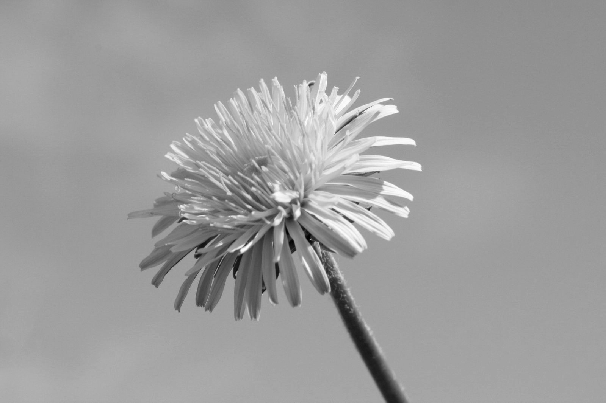

## imgtoolpy

 [](https://codecov.io/gh/UBC-MDS/imgtoolpy) 

[](https://imgtoolpy.readthedocs.io/en/latest/?badge=latest)


### Team Members

|Name    |  Github   |
|---------|---------------------|
|Ruidan Ni |  [rita-ni](https://github.com/rita-ni)|
|Frank Lu|  [Frank Lu](https://github.com/franklu2014)|
|Kexin Zhao| [Margaret8521](https://github.com/Margaret8521)|


### Package Overview

`imgtoolpy` is a Python package that is intended to allow users to compress, sharpen and crop an input image.
Our package only allows the input image to be a 3D numpy array and output the manipulated image as a 3D numpy array. It contains three functions: `compress()`, `sharpen()`, and `crop()`.


### Feature Description

- `compress`:
  - This function quantizes an image by restricting each pixel to only take on one of the desired colour values
  and return a version of the image (the same size as the original) where each pixel's original colour is replaced with the nearest prototype colour.


- `sharpen`:
  - This function enhances the edges in the image and returns a sharper-looking image.  At this moment, this function is restricted to gray-scale images only

- `crop`:
  - A function that crop image size by removing border pixels until desired height and width are reached. This function take image input in the form of a 3D array.


### Installation:

```
pip install -i https://test.pypi.org/simple/ imgtoolpy
```

### Related Packages

  There are a few existing Python packages that perform content-aware image resizing, such as `pyCAIR` (available on [PyPI](https://pypi.org/project/pyCAIR/)), and [seam-carver](https://pypi.org/project/seam-carver/). Currently, there is no package available on CRAN to resize images based on the same mechanism, however, there is a package available on Github to [seam carve image](https://github.com/vgorte/SC-Package-R).  Also, there are similar packages for image manipulation such as [scikit-image](https://github.com/scikit-image/scikit-image), which could be used for filtering and transforming images.

### Dependencies

[tool.poetry.dependencies]
- python = "^3.7"
- sklearn = "^0.0"
- numpy = "^1.18.1"
- pandas = "^1.0.1"
- scipy = "^1.4.1"
- scikit-image = "^0.16.2"

[tool.poetry.dev-dependencies]
- pytest-cov = "^2.8.1"
- pytest = "^5.3.5"
- sphinx = "^2.4.3"
- sphinxcontrib-napoleon = "^0.7"


### Usage

|Task    |  `from imgtoolpy import compress, crop, sharpen`   |
|---------|---------------------|
|Compress an image to 3 bits per channel (2^3=8 colors)|  `compress.compress(image, 3)` |
|crop an image to desired width and height  |  `crop.crop(image, 20, 20)`|
|Sharpen an image by detecting and enhancing the edges|  `sharpen.sharpen(image)`|

### Usage Scenarios

First, we should load the imgtoolpy library:

`from imgtoolpy import compress, crop, sharpen`

We are going to use `butterfly.jpg` image which is in the `img` folder of this repository for illustration.


We can apply the compress function:
`compress.compress(image, 3)`

```
import os

from matplotlib.pyplot import imread, imshow, imsave

image = imread(os.path.join("butterfly.jpg"))

imsave(os.path.join('compress.jpg'), compress.compress(image, 4))
```


We can also apply the crop function:
`crop.crop(image, 400, 400)`


```
import os

from matplotlib.pyplot import imread, imshow, imsave

image = imread(os.path.join("butterfly.jpg"))

imsave(os.path.join('crop.jpg'), crop.crop(image, 400, 400))
```


We can also apply the sharpen function:
`sharpen.sharpen(image)`

```python
import os
from matplotlib.pyplot import imread, imsave, cm

image = imread(os.path.join("img", "free-wallpaper.jpg"))
res = sharpen(image)
# save the monotoned original image
imsave(os.path.join("img", "sharpen_before.png"), res[0], cmap = cm.gray)
# save the sharpened image
imsave(os.path.join("img", "sharpen_after.png"), res[1], cmap = cm.gray)
```

 


### Documentation
The official documentation is hosted on Read the Docs: <https://imgtoolpy.readthedocs.io/en/latest/>

### Credits
This package was created with Cookiecutter and the UBC-MDS/cookiecutter-ubc-mds project template, modified from the [pyOpenSci/cookiecutter-pyopensci](https://github.com/pyOpenSci/cookiecutter-pyopensci) project template and the [audreyr/cookiecutter-pypackage](https://github.com/audreyr/cookiecutter-pypackage).
